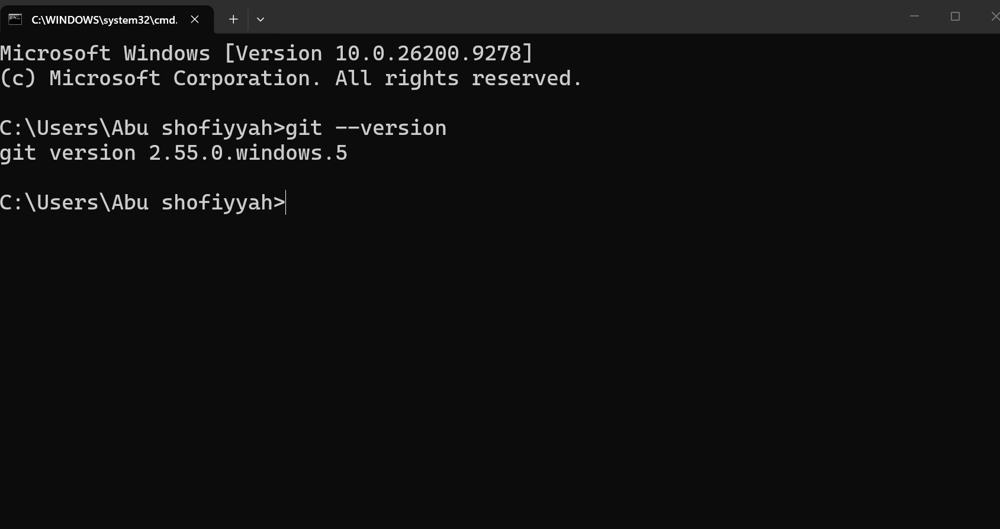
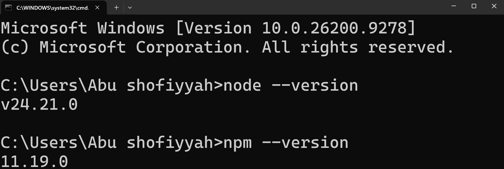
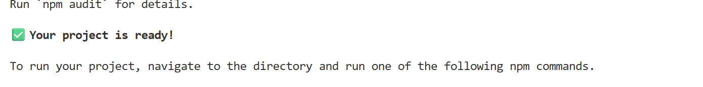
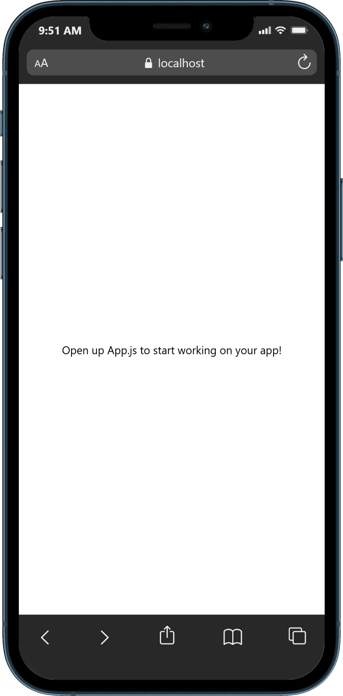

# **Praktikum Mentiapkan Memulai Pemrograman Mobile dengan React Native**
## **Tujuan Pembelajaran**
Setelah menyelesaikan modul praktikum ini, mahasiswa diharapkan mampu:
- Menginstal Git dan Github
- Menginstal Node.js dan NPM
- Menginstal Expo CLI
- Membuat project React Native
- Menjalankan project React Native

1. Install Git di Local 
    - unduh dan Instal Git Via https://git-scm.com/install/windows
    - Verifikasi Git (buka cmd dan ketik "git --version")
    

    
2. Instal Node JS
    - Unduh dan Instal Node JS Via https://nodejs.org/en/download/
    - Verifikasi Node JS (buka cmd dan ketik "node --version" "npm --version")
    

3. Memulai dan membuat Projek dengan Framework Expo 
    - Buka terminal pada code editor 
    - Pastikan aktif di directory yang dituju
    - Ketikan (npx create-expo-app ptmn2 --template blank ) 
    - tunggu hingga proses install selesai 
    - Projek Selesai
    

4. Menjalankan Projek React Native
    - Masuk ke directory projek (cd ptmn2)
    - Jalankan projek (npx expo start)
    - Scan QR Code dengan Aplikasi Expo Go
    - jika ingin run emulator di WEB ketik w
    - di terminal "npx expo install react-dom react-native-web"
    - npx expo start --web

5. LATIHAN PERTEMUAN-2
    - Tambahkan text berupa
    - Nama Lengkap
    - Tempat Tanggal Lahir
    - Cita-Cita
    - Rencana Hidup